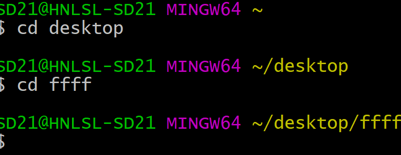
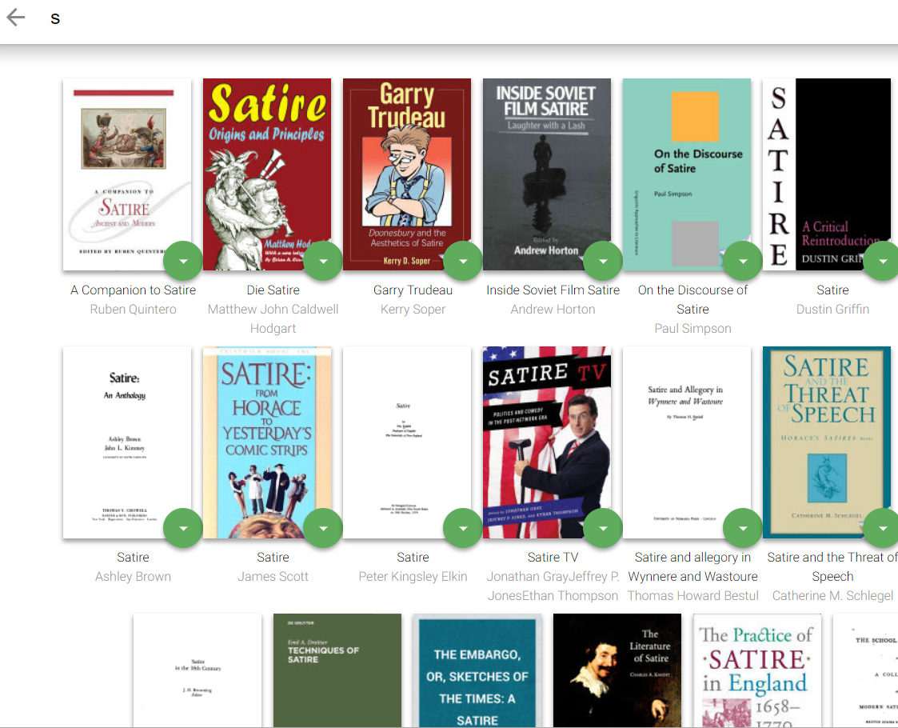
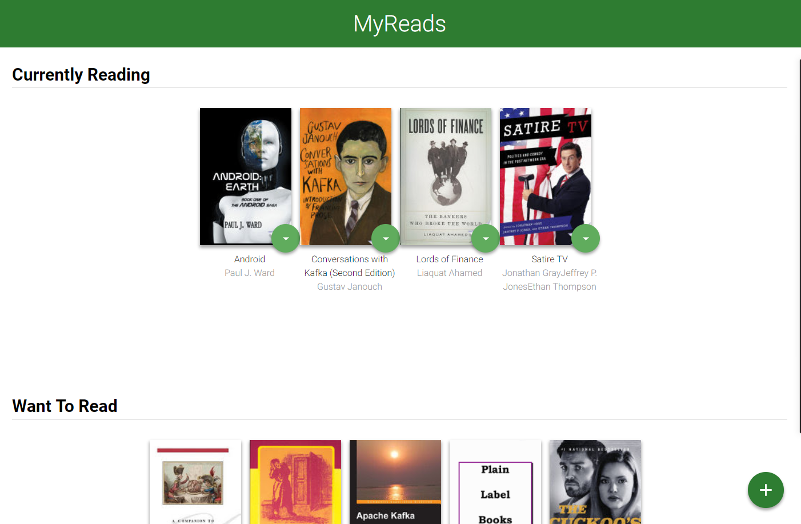

Udacity-react
=============

Step1

* git clone form my GitHUb 

     commond: git clone git@github.com:linzhoucool/Final-2600.git

* use git bash and into the path

* Download NPM
   
    commond:npm install

* start NPM 

    commond:npm start

     Introduction:
     =============

     This app is a bookshopApp , it shows what react works !
     React is a script of FaceBook .It can show a easy way to connect javascript and react to complete any things!

    Usage
    -----

    

    As the picture show that the title is the myreads. There is a coupe books on the read now .U can click right click and see a list show  "currently reading" , "read" , "want to read" 

    You can choose any books to any bar what you like! Also there is a add button on the corner of the right bottom !
    It is the search buttom . Click it and you will see it change to another page. Placeholder is "search any books and author" You can type any world to search you lovely book. It seems like a library ! isn't it ? 

